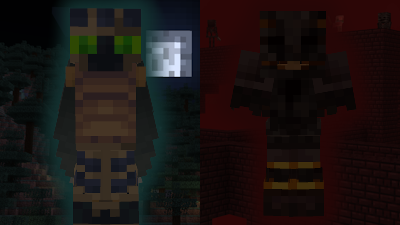
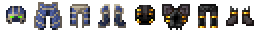
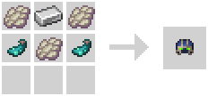
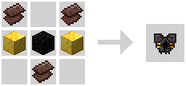

# Mob Armory
**Collect powerful armor themed around mobs and gain their unique abilities**

## What the Pack does
This pack **adds new armor sets**, each **themed around a specific mob**.

Each armor piece gives a **unique and powerful passive buff**, like allowing you to **double jump** or **igniting any arrows** you fire.

## Optaining the Armor Sets

The armor pieces can be crafter in the **regular crafting table**.

You will **unlock the recipe** for an armor piece once you **pick up an item that is used to craft it**.
From then on you can see it in the **recipe book** in crafting tables.

You can see **all available armor sets** in the "**Mob Armory**" **advancement** tab.
Though not every piece of an armor will show there in the beginning.

## Compatability
If you want to play this pack with [Iris shaders](https://modrinth.com/mod/iris), you also need to add [CIT Resewn](https://modrinth.com/mod/cit-resewn) to be able to see the armor properly.

If you want to use this pack as a data pack with other data packs, I highly recommend merging all the data packs and resource packs using [weld](https://weld.smithed.dev/).
